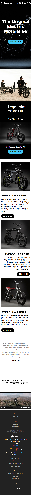
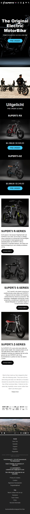
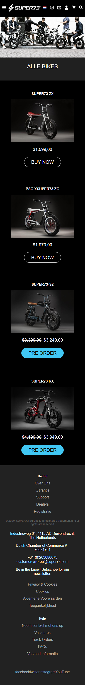
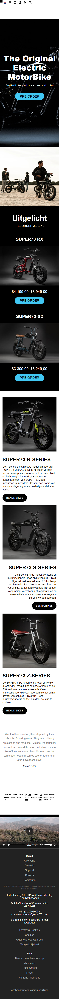
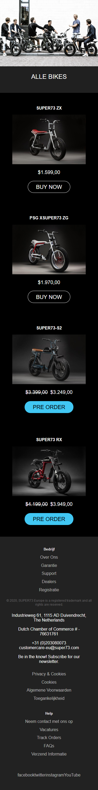
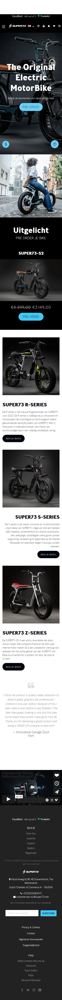
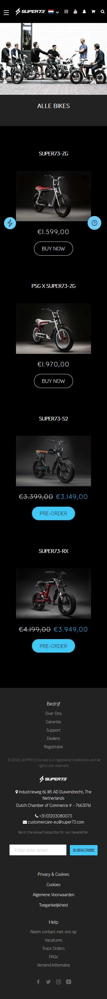

# Procesverslag
**Auteur:** Stijn van Fraeijenhove

Markdown cheat cheet: [Hulp bij het schrijven van Markdown](https://github.com/adam-p/markdown-here/wiki/Markdown-Cheatsheet). Nb. de standaardstructuur en de spartaanse opmaak zijn helemaal prima. Het gaat om de inhoud van je procesverslag. Besteedt de tijd voor pracht en praal aan je website.

## Bronnenlijst
1. https://fontawesome.com/icons/instagram?style=brands <!-- social media icoontjes -->
2. https://commons.wikimedia.org/wiki/File:Flag_of_the_Netherlands.svg <!-- icoontje van nederlandse vlag --> 
3. -...-

## Eindgesprek (week 7/8)

Het was alweer een tijdje geleden dat ik had gecodeerd toen we aan deze opdracht begonnen, dit bleek niet echt een probleem te zijn. De meeste dingen had ik nog paraat en ik kwam er opnieuw weer achter waarom ik dit leuk vind. Het voelt als een soort puzzel die opgelost moet worden. De “standaard” dingen kreeg ik vrij goed voor elkaar. Het was leuk om met media querys te werken, je kan hier echt nice dingen mee doen. Grid heb ik niet gebruikt in mijn site omdat alles vrij goed te flexboxen was maar ik denk dat ik dit in de toekomst zeker wil gaan gebruiken. 

Verder was het een zware periode. Ik had de afgelopen maanden moeite met het thuis werken en om de motivatie te vinden om aan de slag te gaan. Zo had ik dieper in Javascript willen duiden maar dit is niet gelukt door een gebrek aan motivatie en tijd. Dit vind ik oprecht jammer omdat ik in een normalen situatie dit heel leuk vind. 
Toch heb ik weer veel geleerd en blijf ik zeker door gaan met coderen en programmeren!

-dit ging goed & dit was lastig-

**Screenshot(s):**

## Voortgang 3 (week 6)

### Stand van zaken
-Het was wederom weer een super drukke week. Niet heel veel kunnen doen dus... Wel heb ik nog een corousel gemaakt op de home pagina> Ook heb ik gezocht naar oplossing voor een image loop bovenaan de home page. 

**Screenshot(s):**
qua statisch uiterlijk ziet de website er op het moemnt niet anders uit dan vorige week. Vandaar dat ik dus geen screenshots bijvoeg.

### Agenda voor meeting

Student 1
-Kan ik met een  document.querySelector of iets in die richting ook css aan spreken en vervangen. Ik moet namelijk images loopen. Normaal doe je dit vanuit de html maar mijn achtergrond image staat in de css.

## Voortgang 2 (week 5)

### Stand van zaken

Op mobiel ben ik klaar met mijn site, als het gaat om het statische gedeelte. Ik moet nog wat dingen toevoegen, bijvoorbeeld het hamburger menu, en een horzontale scroll.
De afgelopen week heb ik niet zo veel voor elkaar gekregen. Hopelijk gaat dit in de komende week beter.

**Screenshot(s):**

### Agenda voor meeting

-Student 1
-Hoe kan ik het bovenste gedeelte van de home pagina goed maken? Dus het om de zo veel seconden verandere van de foto en tekst.
-Hoe kan ik de header bovenop de main content zetten, nu word de img een beetje afgsneden, ik maak nu ook gebruik van een z-index om hem er op te leggen misschien dat dat het probleem verooraakt.

Student 2
-Hoe krijg je de achtergrond van een tekst een stuk langer en hoe kan ik daar een foto overheen zetten?
-Ik heb het idee dat de preview van brackets soms gek doet, doordat hij soms dingen niet aanpast of dingen vanuit zichzelf.

Student 3
-Hoe wordt mijn zoekbutton een vergrootglas?

Student 4
-Hoe voeg je items toe aan je header als die groter wordt

### Verslag van meeting

## Voortgang 1 (week 3)

### Stand van zaken

Ik ben begonnen met de HTML van de main. De "simpele" dingen gingen goed. Ik heb de wat lastigere carousel dingen uitgesteld. De footer was lastig mar is uiteindelijk goed gelukt. De basis is er nu. Hier kan ik mee verder werken, nu nog de moeilijkere dingen en de header.

**Screenshot(s):**

### Agenda voor meeting

Student 1
-hoe maak je een oneindige loop van fotos horizontaal?
-hoe zorg je er voor dat fotos na 5 sec veranderen, + tekst?
-Hoe kan ik het hamburger menu fiksen?

Student 2
-Wanneer gebruik ik te veel classes? Is het aantal wat ik heb te veel?

Student 3
-Gebruik ik teveel div's?

Student 4
-Hoe maak je een dropdown met transition die over andere tekst heen valt?
-Hoe maak je een dropdown navigatie, die navigeert naar content op dezelfde pagina?
-Hoe kan ik zien welke icon (<i> element) er word gebruikt?

### Verslag van meeting

Het lijkt er op dat ik de goede kant op ga. Er moet nog van alles gebeuren maar op dit punt van het vak is dat normaal.

## Breakdownschets (week 1)

## Intake (week 1)
-uitwerken voor de kick-off werkgroep - begin van de eerste week-

**Je startniveau:** -Rood

**Je focus:** Volledig responsive

**Je opdracht:** https://www.highsnobiety.com/

**Screenshot(s) van de eerste pagina (small screen):**

**Screenshot(s) van de tweede pagina (small screen):**

